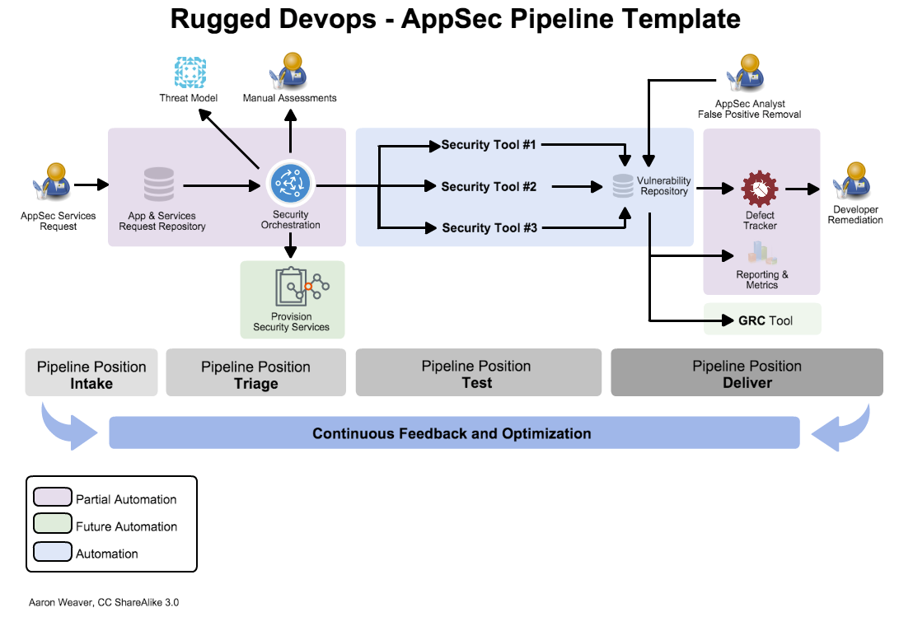
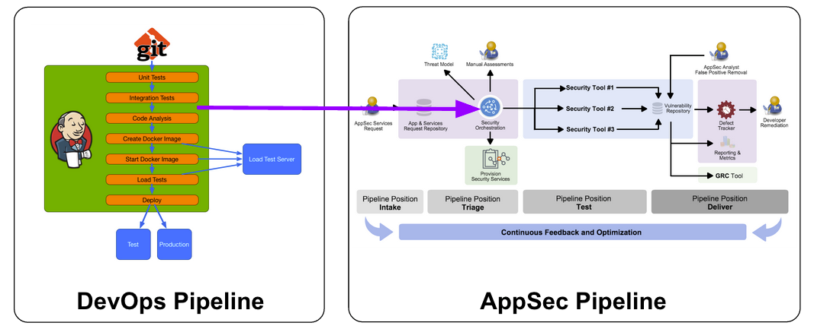

---

layout: col-sidebar
title: Pipeline Design Patterns
tags: pipeline-design-pattern patterns

---

## What is an AppSec Pipeline?

An AppSec Pipelines takes the principles of DevOps and Lean and applies
that to an application security program. An AppSec pipeline is designed
for iterative improvement and has the ability to grow in functionality
organically over time. When starting out an AppSec Pipeline choose the
area that is your greatest pain point and work on a reusable path for
all the AppSec activities that follow.

Pipelines have four distinct areas which will be covered in depth. The
first is the "Intake process" or "first impression." This is where
customers request AppSec services such as dynamic, static or manual
assessments from the AppSec team. The intake process consists of an
application repository that a requestor will either choose from a
listing of applications or provide the details of the application. The
second part is "triage" where the determination is made for applying the
requested services. An application request may have an automated scan in
which case a request would be made to conduct a ZAP scan. The third part
is "test" which is the heart of the pipeline. It is here where all the
AppSec tools are automated, results are fed into a central repository
and reviewed for false positives. Finally the end of the pipeline is
"deliver" where the results are distributed to the customer. This will
vary by organization, however most pipelines will integrate with a
defect tracker and will produce summary metrics and reporting for senior
management.

The goal of an AppSec Pipeline is to provides a consistent process from
the application security team and the constituency which typically is
developers, QA, product managers and senior stakeholders. Throughout the
process flow each activity has well-defined states. The pipeline relies
heavily on automation for repeatable tasks so that the critical
resource, AppSec personnel, is optimized.

### Pipeline - Intake (“First Impression”)

The intake portion of the
pipeline is one of the most important aspects of the pipeline. It is
here where services are requested from the team. Each service request
should be clearly stated and defined. For example consider grouping
service requests into bundles. An application security assessment
usually consists of a dynamic scan, static scan and manual review.
Bundle these into one request and title it 'Application Security
Assessment'.

The pipeline request should feed into an application repository that
keeps track of the metadata on the application, key contacts, prior
engagements and current vulnerabilities.

#### Application Metadata
Knowing the background details about an application is an important part
of carrying out a successful application assessment. By gathering this
data key decisions can be automated. For example if you know that the
application being assessed is a critical application, has PII and has 1
million records then you can automatically recommend and or require
certain activities. These activities could include a threat model, an
automated assessment with manual review.

Key fields recommended for intake are the following:

  - **Application General Information**: Name, Brief Description,
    Business Line
  - **Application Metadata**: Business Criticality, Platform, LIfecycle,
    Origin, User Records, Revenue, External Audience, Internet
    Accessible
  - **Technologies**: Coding Language, Data Store, DDoS Protection,
    Firewall, Framework, Hosting Provider, Operation System, Third-Party
    Component, Web Server
  - **Regulations**: Examples: PCI, SOC, FERPA DPA, SOX etc.
  - **Data Elements**: PII (First name, Last name, Email, Address,
    Postal Code, Social)

#### Key Concepts

  - Bundle application service requests instead of offering al la carte.
  - Ask for data about applications only once
  - Have data reviewed periodically. (A great time is when new services
    are requested on the application.)

**Recommended Tools** A complete listing of tools and review will be in
the Pipeline Tools section.

  - : An application security utility to assist in the organization and
    prioritization of software security activities and defect tracking
    application.
      - Dashboard showing entire application portfolio and last
        engagement dates
      - Applications requiring engagements
      - Importers for many scanners
      - Integration with Jira
      - API for integration with security tools

### Pipeline - Triage

  - Inbound request triage
      - Ala Carte App Sec
      - Dynamic Testing
      - Static Testing
      - Re-Testing mitigated findings
      - Mix and match based on risk

#### Key Concepts

  - Activities can be run in parallel
  - Automation on setup, configuration, data export
  - People focus on customization rather than setup

### Pipeline - Test

### Pipeline - Deliver

Source of truth for all AppSec activities

  - Dedupe / Consolidate findings
  - Normalize scanner data
  - Generate Metrics
  - Push issues to bug trackers
  - Report and metrics automation REST + tfclient
  - Source of many touch points with external teams

### How do I integrate an AppSec Pipeline into my existing pipeline(s)?

