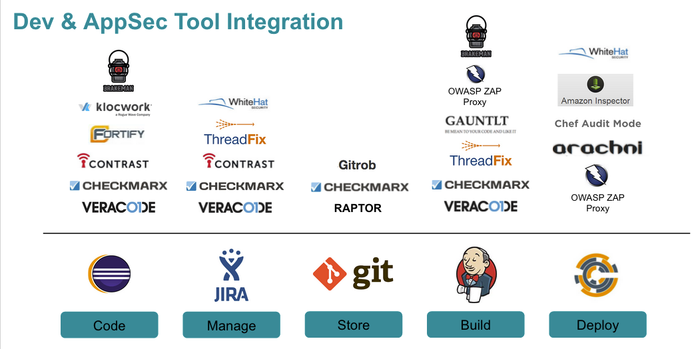

---

title: Pipeline Tools
layout: col-sidebar
tab: true
order: 2
tags: pipeline-tools tools

---

# Pipeline Tools

## What are DevOp Security Pipeline Tools?

DevOp security pipeline tools are written with the mindset of API first.
The goal is that a security tool will expose all the core functionality
of the product as an API. Tools need to have an API so that the 'All the
things' can be automated. Each tool will be evaluated with the criteria
outlined below including example pipeline use cases.

## Evaluation Criteria

**Application Description:** Overview of the security tool, description
and product web page.
**API:** The type of API (REST, SOAP), API coverage (% of total features
available via the API) and API Docs.
**Pipeline Position:** Where in the AppSec pipeline the tool would be
best suited to reside
**Cloud Scalable:** Is the tool cloud aware and can the tool scale based
on demand?
**Runs as a Service:** Can the tool run as a service or in headless
mode?
**Pipeline Example:** Link to an example use case of the tool in the
pipeline
**Client Libraries:** What client libraries are written to assist in
integration. For example a python or Go library.
**CI/CD Plugins:** Does the tool have CI/CD plugins for integration into
a DevOps pipeline. For example a Jenkins plugin.
**Data Sent to the Cloud:** What kind of data, if any, is sent off
premise to the cloud? Is there an option to keep all data in-house?

## Results

We are currently working on gathering a list of the current tools and
evaluating each tool based on the criteria listed. The goal is to create
a one page wiki document of the application.

## Sample Tooling by Phase

